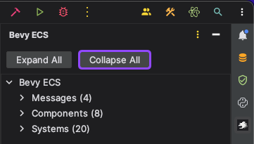
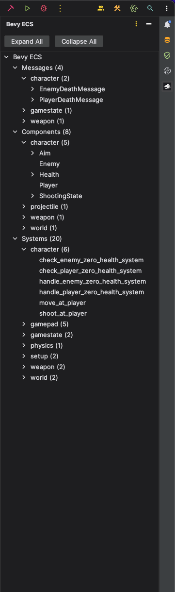

# Bevy ECS Plugin

A RustRover Plugin to show Enities, Components and Systems in the IDE.

### Collapsed

### Expanded

## Foreword

This is completely vibe coded. Do not take the code seriously as it is more of an MVP for the idea.

## Contribution

I would be really thankful for contributions and helping me with this ai slop. I have no idea how to code plugins.